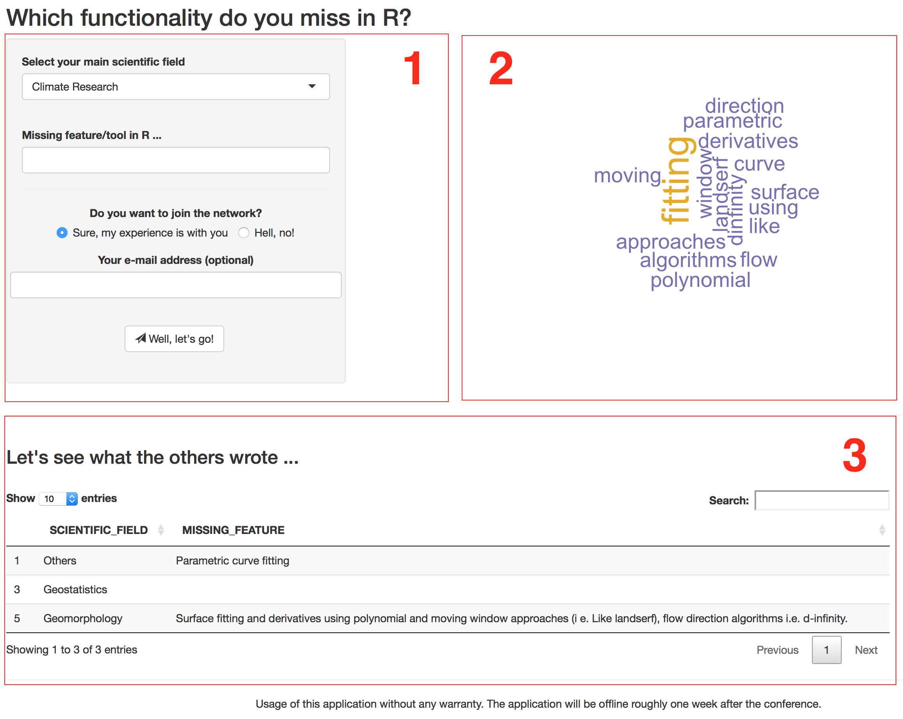

# ShinyPollApp

This [Shiny](https://shiny.rstudio.com) application was developed to conduct a brief poll on missing features in [R](https://www.r-project.org) with regard do geosciences during a [PICO session](http://meetingorganizer.copernicus.org/EGU2017/session/24971).

PICO session convener: Michael Dietze, Sebastian Kreutzer and Oliver Korup at the [EGU 2017](http://www.egu2017.eu) in Vienna (Austria). 

The application consists of three frames:

1. An input frame 
2. A result visualisation frame, here a word clouds showing the primary poll results
3. A table frame showing the raw results in more detail



The application uses an external [MongoDB](https://en.wikipedia.org/wiki/MongoDB) to
store the results. 

# How to run?

The application can be either run on a local device or an external 
[Shiny Server](https://www.rstudio.com/products/shiny/shiny-server/).

**Please note**

* You need an external, separate, database access to store and read the poll data! 
* Your database information need be stored in a [YAML](https://en.wikipedia.org/wiki/YAML) file name `db_access.yml`

Example `db_access.yml`
```
collection: "MyPoll"
database: "my_database"
url: "my_mongodb_url"
```

# Licence

This program is free software: you can redistribute it and/or modify
it under the terms of the GNU General Public License as published by
the Free Software Foundation, either version 3 of the License, or
any later version.

 This program is distributed in the hope that it will be useful,
 but WITHOUT ANY WARRANTY; without even the implied warranty of
 MERCHANTABILITY or FITNESS FOR A PARTICULAR PURPOSE.  See the
 [GNU General Public License](https://github.com/RLumSK/ShinyPollApp/blob/master/LICENSE) 
 for more details.

